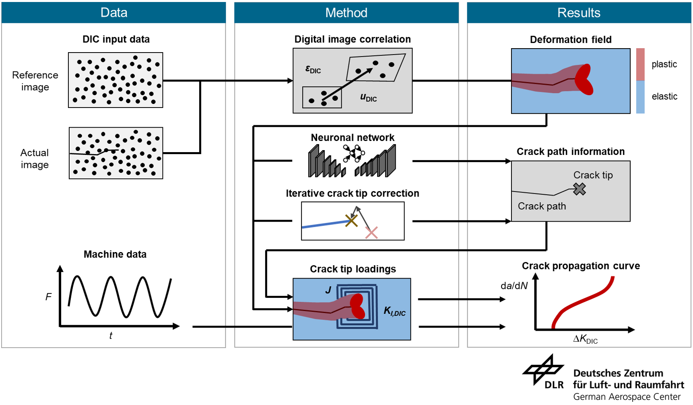
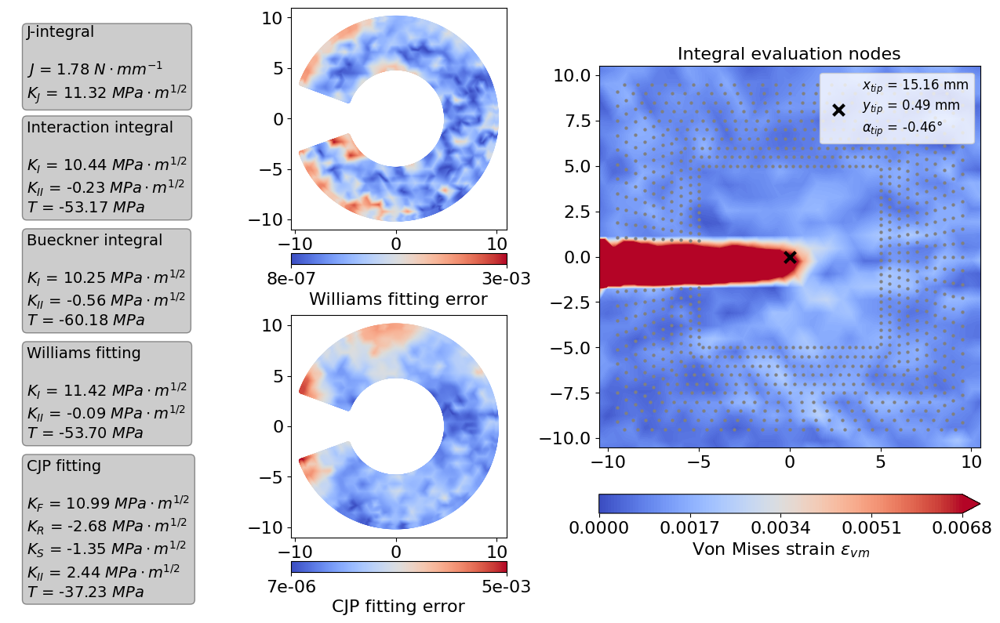

# Crack Analysis Tool in Python - CrackPy 
[](https://doi.org/10.5281/zenodo.10990494)

The methodology for fatigue crack growth (fcg) experiments has not changed for decades and usually still relies on the concept that a 
theoretical stress intensity factor is calculated with respect to a standardized specimen geometry, applied load, 
and projected crack length measured by integral methods like direct current potential drop [**1**]. Such conventional fcg 
experiments are time-consuming and therefore very expensive. On the other hand, these experiments only result in 
a single material curve, i.e. a-N, which is hard to reproduce even under identical testing conditions. 
Consequently, the experimental outcome-to-cost ratio is relatively low. 

Digital image correlation (DIC) has become a state-of-the-art tool to increase insight in experimental mechanics due to its
wide availability and the possibility to automatically gain full-field information (displacements and strains). In particular, it is well-suited to analyze (fatigue) cracks [**2, 3**].

This Python package provides a pipeline, which takes an arbitrary number of DIC or simulation results and calculates various 
fracture mechanical parameters.

|  |
|:--:|
| **_Schematic overview of data flow in CrackPy_** |

To do so, we use a specific DIC data format which is stored as a `_Nodemap_.txt` text file.
This file contains the nodal full-field displacement and strain data as well as information about the 
experiment and metadata. For every single file (referring to one time step of the experiment), the crack 
tip location and crack path geometry is detected using a trained artificial neural network [**4**]. After that, 
the crack tip information together with the displacements and strains are used by our fracture analysis module. 
This module contains a pipeline that computes stress intensity factors based on J-, interaction, and conjugate-work integrals, 
fits the Williams expansion to calculate arbitrary Williams series coefficients or fits the CJP model to calculate 
stress intensity factors which take effects of plasticity into account.
   
## Scope of the Package

The following graph shows an overview of the main CrackPy modules **structure elements**, **dic**, **simulation**, **crack detection**, and **fracture analysis**.

|  |
|:--:|
| **_Overview of main modules, functions and files in CrackPy_** |

The structure element module provides classes for structural elements such as _experiment_ or
_data file_. Most of these are currently just placeholders to add functionality later on. However, a very important structural element is the _Material_ class containing information about the
material law (elastic & shear moduli, stiffness matrix, etc.) as well as the _Nodemap_ class, containing information about the data structure of the nodemap.
We provide two modules, i.e. **dic** and **simulation**, which feature utilities to generate nodemaps from a 
specific software. Therefore, these modules can only be used if CrackPy is installed on an Aramis system equipped with 
an actual GOM Aramis Professional software >v2020 (in case of **dic**) or if a valid version and license of Ansys is available 
(in case of **simulation**). For more details, we refer to our Wiki. Once you have stored your nodemap files either from dic, 
simulation or from a different source, you reach the heart of our fracture analysis. You can detect crack paths and crack tips fully automatically
using our **crack detection** module. This module provides two independent methodologies for crack detection -
our line intercept method together with an iterative crack tip correction algorithm based on the Williams expansion [**15**] and our trained convolutional neural networks [**4**, **9**]. 
We store the crack tip information in a file (this can also be generated manually) and use it as input for 
the **fracture analysis** pipeline. Here we offer a wide range of methods and algorithms: 
1. Calculate _J-integral_ [**5**, **10**]
2. Calculate stress intensity factors (mode I, mode II) by _interaction integral technique_ [**11**, **12**]
3. Calculate stress intensity factors and Williams series coefficients using _Bueckner's conjugate work integral_ [**6**, **14**]
4. Calculate _higher order singular terms (HOSTs)_ or _higher order regular terms (HORTs)_ of the Williams series [**7**] by fitting the 
   theoretical displacement field to the experimental (or simulated) data.
5. Calculate CJP stress intensity factors which may take effects of plasticity into account by fitting the theoretical displacement field of the _CJP model_ [**8**] the experimental (or simulated) data [**13**]   


Here is an example of the output plot for one single time step...

|  |
|:--:|
| **_Example output for a single input_** |

... and an example of how these methods can enable _hybrid approaches of mechanical and data-driven analysis_.

|  |
|:--:|
| **_Various possible calculated stress intensity factors for a complete crack growth experiment. Each data point refers to one DIC measurement, i.e. one set of experimental displacements and strains_** |

For us, it was important that all these methods are implemented independent of the source of 
displacement and strain data, i.e. you can also apply all these methods on data from other sources such as finite element simulations, as long as the format of displacements
and strains matches the one used here (Checkout our [Wiki](https://github.com/dlr-wf/crackpy/wiki) 
for detailed information) and fulfills the plane stress condition. We believe that a wider availability of
automated analysis - and, therefore, more **data-driven methods** -  will be very beneficial for the experimental
mechanics community. This is why we aim to make them easily accessible and applicable. However, this package only covers the topic of 
**(fatigue) cracks in ductile materials**. Although most of our methods are (theoretically) independent of the investigated material, we only tested them on aluminium alloys so far.

References:

1. **ASTM International E-647** Standard Test Method for Measurement of Fatigue Crack Growth Rates
2. **Roux et al. (2006)** Stress intensity factor measurement from digital image correlation: 
   post-processing and integrated approaches. 
   _International Journal of Fracture 140: 141-157_ 
   [https://doi.org/10.1007/s10704-006-6631-2](https://doi.org/10.1007/s10704-006-6631-2)
3. **Réthoré J et al. (2005)** Estimation of mixed-mode stress intensity factors using digital 
   image correlation and an interaction integral. 
   _International Journal of Fracture 132: 65-79_ 
   [https://doi.org/10.1007/s10704-004-8141-4](https://doi.org/10.1007/s10704-004-8141-4)
4. **Melching D et al. (2022)** Explainable machine learning for precise fatigue crack tip detection.
   _Scientific Reports 12, 9513_ 
   [https://doi.org/10.1038/s41598-022-13275-1](https://doi.org/10.1038/s41598-022-13275-1)
5. **Becker T et al. (2012)** An approach to calculate the J-integral by digital image 
   correlation displacement field measurement. 
   _Fatigue and Fracture of Engineering Materials and Structures 35 (10): 971-984_
   [https://doi.org/10.1111/j.1460-2695.2012.01685.x](https://doi.org/10.1111/j.1460-2695.2012.01685.x)
6. **Chen Y Z (1985)** New path independent integrals in linear elastic fracture mechanics. 
   _Engineering Fracture Mechanics 22 (4): 48-51_
   [https://doi.org/10.1016/0013-7944(85)90131-6](https://doi.org/10.1016/0013-7944(85)90131-6)
7. **Williams M L (1961)** The Bending Stress Distribution at the Base of a Stationary Crack. 
   _Journal of Applied Mechanics 28 (Issue 1)_ 
   [https://doi.org/10.1115/1.3640470](https://doi.org/10.1115/1.3640470)
8. **Yang B et al. (2021)** New algorithms for optimised fitting of DIC data to crack tip plastic zone using the CJP model.
   _Theoretical and Applied Fracture Mechanics 113, 10295_ 
   [https://doi.org/10.1016/j.tafmec.2021.102950](https://doi.org/10.1016/j.tafmec.2021.102950)
9. **Strohmann T et al. (2021)** Automatic detection of fatigue crack paths using digital image correlation and 
   convolutional neural networks.
   _Fatigue and Fracture of Engineering Materials and Structures 44: 1336-1348_
   [https://doi.org/10.1111/ffe.13433](https://doi.org/10.1111/ffe.13433)
10. **Rice J R (1968)** A Path Independent Integral and the Approximation Analysis of Strain Concentration by Notches and Cracks.
    _Journal of Applied Mechanics 35: 379-386_
    [https://doi.org/10.1115/1.3601206](https://doi.org/10.1115/1.3601206)
11. **Stern M et al. (1976)** Contour integral computation of mixed-mode stress intensity factors. 
    _International Journal of Fracture 12(3): 359-368_
    [https://doi.org/10.1007/BF00032831](https://doi.org/10.1007/BF00032831)
12. **Breitbarth E et al. (2019)** Determination of stress intensity factors and J integral based on digital image correlation. 
    _Frat ed Integrita Strutt. 13: 12–25_
    [https://doi.org/10.3221/IGF-ESIS.49.02](https://doi.org/10.3221/IGF-ESIS.49.02)
13. **Christopher C et al. (2007)** Towards a new model of crack tip stress fields.
    _International Journal of Fracture 148(4): 361-371_
    [https://doi.org/10.1007/s10704-008-9209-3](https://doi.org/10.1007/s10704-008-9209-3)
14. **Melching D et al. (2023)** Advanced crack tip field characterization using conjugate work integrals.
    _International Journal of Fatigue 107501, 169_
    [https://doi.org/10.1016/j.ijfatigue.2023.107501](https://doi.org/10.1016/j.ijfatigue.2023.107501)
15. **Melching D et al. (2024)** A universal crack tip correction algorithm discovered by physical deep symbolic regression.
    _Preprint_
    [https://arxiv.org/abs/2403.10320](https://arxiv.org/abs/2403.10320)


## Installation
Just install via pip from the GitHub repository
```
pip install --upgrade git+https://github.com/dlr-wf/crackpy.git
```

## How to use?
To check out how to use the package, please read our [Wiki](https://github.com/dlr-wf/crackpy/wiki).

## License and Limitations
The package is developed **for research only and must not be used for any production or specification purposes**. 
The Package is **under current development and all functionalities are on a prototype level**. 
Feel free to use the code; however, **we do not guarantee in any form its flawless implementation or execution**.
However, if you run into errors in the code or find any bugs, we will be happy if you contact us.

Licensed under MIT License (see LICENSE file)

## How to cite
Please cite as\
_Strohmann T, Melching D, Paysan F, Klein A, Dietrich E, Requena G and Breitbarth E_\
**Crack Analysis Tool in Python - CrackPy** (2022)\
[DOI: 10.5281/zenodo.7319653](https://doi.org/10.5281/zenodo.7319653)

## Get in touch
If you are interested in the code, or in our work in general, feel free to contact us 
via email at [eric.breitbarth@dlr.de](mailto:eric.breitbarth@dlr.de).

If you want to contribute to this repository, just get in touch as well. We will be happy.

## Intellectual Property and Authorship 
This package is property of the German Aerospace Center 
(Deutsches Zentrum für Luft- und Raumfahrt e.V. - DLR) 
and was developed in the Institute of Materials Research. Feel free to check out our [LinkedIn channel](https://www.linkedin.com/company/dlr-wf).

**Authors:**\
_Tobias Strohmann_\
_David Melching_\
_Florian Paysan_\
_Eric Dietrich_\
_Guillermo Requena_\
_Eric Breitbarth_

**Contributors:**\
We thank\
_Vanessa Schöne_\
_Alina Klein_\
_Ferdinand Dömling_\
_Erik Schultheis_\
for continuous support regarding tests and user feedback for the package.
