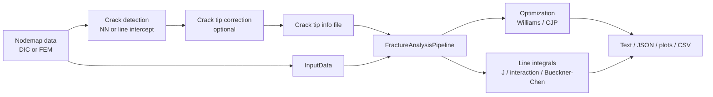

# CrackPy Architecture Wiki

Status: architecture wiki home
Created: 2026-05-14
Scope: observed architecture, scientific context, data flow, coupling, shared terminology, open questions, and future refactor candidates.

This directory is an Obsidian-style working memory for CrackPy architecture planning. It separates observed system reality from shared language, unresolved naming debt, and future architecture proposals.

## How To Use This Wiki

- Start here, then read [[system-map]] for package-level orientation.
- Use [[glossary]] for stable vocabulary and [[terminology-report]] for unresolved naming debt.
- Use [[open-questions]] before proposing architecture changes.
- Use [[decision-log]] for accepted planning decisions.
- Keep future design ideas out of observed-system notes; link to [[refactor-notes]] instead.

## Index And Operating Rules

- `AGENTS.md`: agent working-memory rules and current planning-only phase.
- [[README]]: this wiki home page.
- [[decision-log]]: accepted or rejected planning decisions that are not ADRs.
- [[open-questions]]: unresolved terminology and architecture questions with stable IDs.

## Observed System Reality

- [[system-map]]: package-level map, package structure, and main runtime flow.
- [[module-inventory]]: raw module-by-module class/function inventory from local inspection.
- [[data-model-input]]: `InputData`, nodemap structures, material data, metadata, VTK conversion, and result I/O coupling.
- [[crack-detection]]: neural-network detection, line-intercept detection, correction, data preparation, and training.
- [[fracture-analysis]]: Williams fitting, CJP fitting, line integrals, pipeline orchestration, and numerical assumptions.
- [[results-io-workflows]]: scripts, test workflows, result readers/writers, plotting, operational dependencies, and result schema observations.

## Domain And Scientific Context

- [[scientific-context]]: literature references, scientific assumptions, numerical methods, and validation signals.
- [[glossary#Fracture Mechanics Terms]]: canonical fracture-mechanics vocabulary used by the architecture wiki notes.
- [[glossary#Experimental And Data Terms]]: experimental and acquisition vocabulary.

## Shared Language And Naming Debt

- [[glossary]]: stable domain, implementation, and architecture vocabulary.
- [[terminology-report]]: extracted implementation terms, naming inconsistencies, ambiguous terms, and unresolved terminology questions.
- [[terminology-literature-inconsistencies]]: recurring source-backed terminology findings from fracture mechanics, FEM, DIC, and related literature.
- [[open-questions]]: question IDs for unresolved terminology and planning decisions.

## Architecture Friction And Future Decisions

- [[coupling-map]]: observed coupling, side effects, implicit interfaces, repeated patterns, and shallow modules.
- [[refactor-notes]]: index of future architecture candidates.
- [[refactor-candidates/index]]: detailed future candidate notes.
- [[refactor-candidates/010-provenance-metadata-architecture]]: future provenance and metadata architecture concept for compact RDF/JSON export and optional detailed provenance.
- [[decision-log]]: accepted planning decisions; no architecture decision records exist yet.

## Architecture Mapping Method

The architecture mapping combined:

- local AST inventory of modules, classes, functions, imports, and package dependencies;
- targeted code reading of core modules and scripts;
- repository searches for literature, assumptions, side effects, and TODO/prototype signals;
- parallel read-only subagent explorations covering input/results, fracture analysis, crack detection, scripts/tests, scientific references, architecture coupling, and terminology.

No production code was refactored in this phase.

## Package Overview

CrackPy is a research package for automatic crack detection and fracture-mechanical analysis of DIC or simulation nodemap data. The README describes the intended flow:

The main architectural theme is that `InputData` is the central mutable carrier, while `FractureAnalysis` and the pipeline classes combine orchestration, algorithm selection, result storage, and output coordination.
