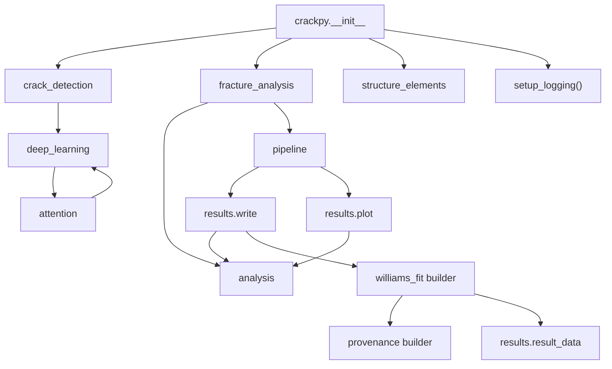

# Coupling Map

Status: observed coupling and side effects
Role: Record observed architecture friction, implicit interfaces, shared state, and side effects. Architecture planning notes live in [[refactor-notes]].

This note records observed system reality. Proposed changes live in [[refactor-notes]].

## High-Coupling Modules

### `InputData`

`InputData` has the highest fan-in and the broadest responsibility set:

- nodemap file reading;
- metadata parsing;
- mutable data container;
- mechanics calculations;
- coordinate transformation;
- VTK export;
- mask creation.

It is consumed by crack detection, fracture analysis, plotting, scripts, and tests. Many callers depend on direct attributes rather than a smaller explicit interface.

### `FractureAnalysisPipeline`

The pipeline has high fan-out:

- reads crack-tip CSV rows;
- constructs data descriptors;
- loads nodemap data;
- computes stresses;
- transforms coordinates;
- runs analysis;
- writes text and JSON;
- plots;
- manages multiprocessing and progress.

### `FractureAnalysis`

`FractureAnalysis` is behavior-rich but has a broad post-run interface. Callers inspect many mutable attributes after `run()`. `OutputWriter` and `Plotter` depend directly on those attributes.

### Results Modules

`results.write` and `results.plot` import `FractureAnalysis`, which couples result emission back to analysis internals and contributes to import cycles.

The newer Williams-fit provenance path reduces part of this coupling by translating `FractureAnalysis` through `crackpy.fracture_analysis.methods.williams_fit.source_adapter` into a `MethodResultSource` before building result/provenance records. This is only a partial seam: `OutputWriter.write_williams_fit_provenance_json()` still starts from `FractureAnalysis`, and legacy text, current JSON, CSV, and plot paths still inspect analysis attributes directly. The actual Williams-fit provenance artifact projection can now start from an explicit `ResultEnvelope` through `write_williams_fit_provenance_artifacts()`, so that projection is testable without the broad analysis facade.

## Import Graph Observations

Observed import shape:

Import side effects:

- importing `crackpy` configures logging globally;
- importing `results.plot` sets the matplotlib backend to `Agg`;
- package `__init__.py` files eagerly import many submodules.

## Hidden Shared State

Mutable default object instances appear in public interfaces:

- `FractureAnalysis(..., integral_properties=IntegralProperties(), optimization_properties=OptimizationProperties())`;
- `Optimization(..., material=Material(), options=OptimizationProperties())`;
- `Nodemap(..., structure=NodemapStructure())`.

These defaults are risky because options are later mutated by default-normalization helpers.

## Constructor Work

Several constructors do substantial work:

- `InputData(nodemap)` reads header and data unless header-only mode is requested;
- `Optimization(...)` builds grids and interpolates data;
- pipeline constructors create output directories and read input data frames;
- `get_model()` is not a constructor but acts like a provider with filesystem and network side effects.

## Implicit Interfaces

Key implicit contracts:

- `InputData` must have arrays with equal first dimension.
- `calc_stresses()` must be called before methods expecting `sig_*` fields.
- `transform_data()` must be called before fracture analysis numerical kernels that assume crack-tip origin.
- `FractureAnalysisPipeline` requires exact crack-info column names.
- result readers require exact tag names from result writers.
- left/right orientation must be represented as specific strings and interpreted consistently.

## Side Effects

- file reads happen during object creation;
- model loading can download from the network;
- detection and fracture pipelines create directories and write files;
- plotting is not optional in some detection paths;
- data transformations mutate arrays in place;
- correction evaluates caller-provided strings for custom functions;
- multiprocessing/progress behavior is embedded in fracture pipeline execution.

## Repeated Patterns

- orientation handling for left/right cracks is repeated across interpolation, detection, plotting, and training data;
- interpolation uses both `ReusableLinearInterpolator` and SciPy `griddata`;
- output/result shape is duplicated across writer, reader, tests, and plotter;
- `InputData` field requirements are repeated as caller assumptions rather than centralized validation.
- Williams-fit result/provenance shape now has a YAML-backed first slice, but CJP, line-integral, Bueckner-Chen, path, CSV, and plot result shapes still remain duplicated or implicit.

## Shallow Or Placeholder Modules

- package `__init__.py` modules mostly re-export and increase import cost;
- `results/result_data.py` is empty;
- `FileStructure` and `DataFile` are shallow wrappers;
- several utility modules are function bags rather than clear seams.
