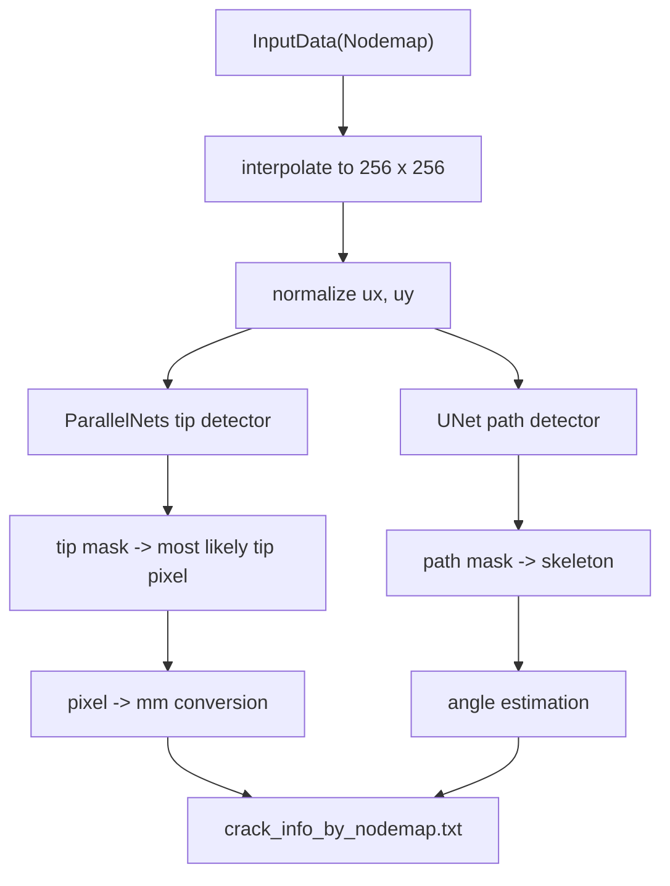

# Crack Detection

Status: observed system reality
Role: Document current crack-detection implementation, training utilities, correction methods, side effects, and detection/fracture handoff. Orientation and model-provider planning lives in [[refactor-candidates/005-side-orientation-module]] and [[refactor-candidates/006-model-provider-seam]].

Terminology references: see [[glossary]] for stable definitions and [[terminology-report]] for ambiguous or overloaded detection terms.

## Core Modules

- `crackpy/crack_detection/detection.py`
- `crackpy/crack_detection/pipeline/pipeline.py`
- `crackpy/crack_detection/line_intercept.py`
- `crackpy/crack_detection/correction.py`
- `crackpy/crack_detection/model.py`
- `crackpy/crack_detection/data/*`
- `crackpy/crack_detection/deep_learning/*`
- `crackpy/crack_detection/utils/*`

## Neural-Network Detection

Main classes:

- `CrackDetection`: detection-window setup, side handling, interpolation, and preprocessing.
- `CrackTipDetection`: runs the tip detector, thresholds segmentation, finds most likely tip, and converts pixels to millimeters.
- `CrackPathDetection`: runs the path detector, thresholds path mask, and skeletonizes path.
- `CrackAngleEstimation`: masks path near the crack tip, keeps the largest connected region, and fits a line to estimate angle.

Data flow:



Crack-detection network expectations:

- input shape `[B, 2, 256, 256]`;
- channels are displacement `ux` and `uy`;
- `ParallelNets` is the current crack-tip detection network; its output contains a segmentation mask and coordinate regressor, but runtime detection uses the mask;
- `UNetPath` is the current compatibility selector and weights artifact stem for a `UNet` crack-path segmentation network;
- crack-tip detection expects the right-side crack convention used during training;
- left-side data is mirrored into the right-side crack convention before detection.

`get_model()` remains the current compatibility function and supports only `ParallelNets` and `UNetPath`. It still combines detector selector, detection task, network architecture, weights artifact, local cache/download policy, and device mapping. C-006 planning now treats those as separate terms before introducing any provider seam.

Detection-grid coordinate mapping:

- current neural detection resamples each physical detection window to a `256 x 256` grid;
- interpolation uses endpoint-inclusive coordinates through `np.linspace(..., pixels)`;
- therefore `256` samples span `255` physical intervals on each axis;
- current crack-tip, crack-path, and angle-radius conversions use `detection_window_size / 255`;
- future planning vocabulary should express this as [[glossary#Detection resampling grid]], `detection_window_extent_mm`, `detection_input_resolution_px`, and derived grid spacing values such as `detection_grid_spacing_x_mm_per_px`;
- current `detection_window_size` remains square-only compatibility vocabulary.

For the current square model, the conceptual mapping is:

```python
detection_window_extent_mm = (detection_window_size_mm, detection_window_size_mm)
detection_input_resolution_px = (256, 256)

detection_grid_spacing_x_mm_per_px = detection_window_extent_mm[0] / (detection_input_resolution_px[0] - 1)
detection_grid_spacing_y_mm_per_px = detection_window_extent_mm[1] / (detection_input_resolution_px[1] - 1)
```

## CrackDetectionPipeline

`CrackDetectionSetup` stores specimen size, sides, stage selection, window size, detection boundaries, start offset, and angle detection radius.

`CrackDetectionPipeline`:

- discovers nodemap stages;
- filters detection stages by maximum force and tolerance;
- loops over sides and stages;
- moves the detection window based on prior crack-tip position;
- runs tip/path/angle detection;
- always writes diagnostic plots during `run_detection()`;
- writes `crack_info_by_nodemap.txt`.

`assign_remaining_stages()` now keeps its legacy `stage -> detection_stage` dictionary but derives it through `map_stage_cycles_to_representative_stages()`. The policy result stored as `input_mapping` uses durable `input_id -> representative_input_id` values, while `stage` remains DIC source metadata for current filenames and outputs.

The output columns are the implicit handoff to fracture analysis:

- `Filename`
- `Crack Tip x [mm]`
- `Crack Tip y [mm]`
- `Crack Angle`
- `Side`

## Data Preparation And Training

`datapreparation.py` imports nodemaps and optional ground truth. Ground truth uses:

- `1` for crack path;
- `2` for crack tip.

`dataset.py` loads `.pt` files, concatenates input/target tensors, and derives crack-tip pixels from `target == 2`.

`transforms.py` includes:

- input normalization;
- crack-tip coordinate normalization to `[-1, 1]`;
- crack-tip/path enhancement;
- random crop, flip, rotation, resize;
- output adapters for masks, coordinates, or combined targets.

`train.py` provides train/validation loops for segmentation and parallel tip models. `ParallelNets` training combines Dice segmentation loss with MSE coordinate loss.

## Line-Intercept Detection

`CrackDetectionLineIntercept` is an independent detection path.

Observed method:

- maps displacement and strain data to a regular grid;
- fits `A*tanh((y-B)*C)+D+E*y` per vertical slice, usually against `uy`;
- interprets fitted `B` as crack-path y-coordinate;
- scans along the inferred path and accepts a crack-tip point only after a minimum count of consecutive `eps_vm` threshold exceedances;
- estimates angle from a local polynomial fit near the tip.

Constructor vocabulary:

- `x_min`, `x_max`, `y_min`, `y_max`: line-intercept evaluation-region bounds in millimeters, not the neural-network detection window.
- `tick_size_x`, `tick_size_y`: requested interpolation-grid spacing in millimeters; actual endpoint-inclusive sample spacing can differ slightly.
- `grid_component`: displacement component used for tanh fitting, currently `ux` or `uy`.
- `eps_vm_threshold`: equivalent-strain threshold applied along the fitted crack path.
- `window_size`: current legacy name for [[glossary#Min consecutive strain exceedance count]]; this behaves as an integer sample count, not a physical window size.
- `angle_estimation_mm_radius`: declared physical radius converted with `tick_size_x` into an approximate number of nearby crack-path samples for angle fitting.

This path depends on `InputData` and often on `calc_stresses(material)` for plotting and correction workflows.

## Crack-Tip Correction

`correction.py` couples crack detection to fracture-analysis optimization.

Correction variants:

- Rethore iterative correction: `dx = -2*a_-1/a_1`, `dy = 0`;
- symbolic-regression correction: `dx = -a_-1/a_1`, `dy = -b_-1/a_1`;
- custom function strings via `eval`;
- direct optimization over Williams fitting error;
- differential evolution;
- brute-force grid search.

Each candidate correction deep-copies `InputData`, transforms it to a candidate crack-tip-centered frame, and runs Williams optimization.

`CustomCorrection` expects full coefficient coverage from `A_-3..A_7` and `B_-3..B_7`; missing terms are filled with zero after warning.

Current correction APIs mostly return relative `dx`/`dy` shifts, and plotting applies those shifts to the detected crack tip. Future result modeling should make the corrected crack-tip estimate the primary output, retain the correction delta as audit metadata, and link to the source crack-tip estimate. This is a planning vocabulary decision; the current code still exposes delta-shaped return values.

## Side Effects

- `get_model()` can create directories and download pretrained detector weights through the default provider.
- detection pipelines write plots and result files.
- data preparation prints progress to stdout.
- plotting helpers create output directories.
- correction can save intermediate plots.
- custom string correction executes caller-provided strings.

## Coupling To Fracture Analysis

The normal pipeline handoff is a CSV-like crack-tip info file consumed by `FractureAnalysisPipeline`. Correction is more tightly coupled: it directly imports and runs `crackpy.fracture_analysis.optimization.Optimization`.

See [[coupling-map]] and [[refactor-notes]].
