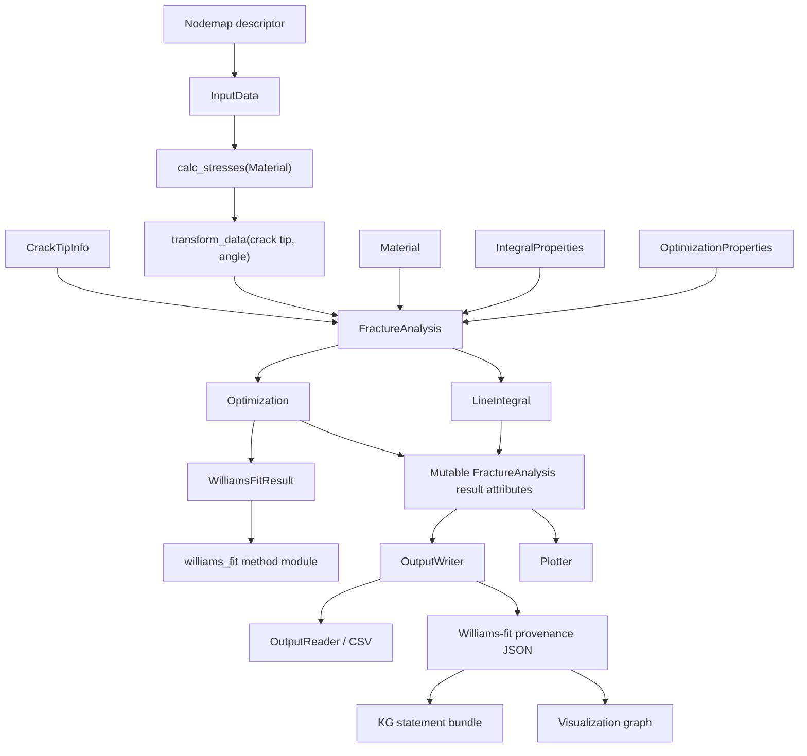

# System Map

Status: observed system reality
Role: Provide the high-level package map and runtime flow. Keep detailed subsystem behavior in the domain notes and keep architecture planning notes in [[refactor-notes]].

## Top-Level Package Shape

```text
crackpy/
  crack_detection/
    data/
    deep_learning/
    pipeline/
    utils/
    correction.py
    detection.py
    line_intercept.py
    model.py
  fracture_analysis/
    methods/
      williams_fit/
    analysis.py
    crack_tip.py
    line_integration.py
    optimization.py
    pipeline.py
    utils.py
  input/
    crack_tip_info.py
    input_data.py
  results/
    envelope_artifacts.py
    graph_visualization.py
    kg_statement_bundle.py
    plot.py
    read.py
    result_data.py
    write.py
  provenance/
    builder.py
    source.py
    spec.py
  structure_elements/
    data_files.py
    material.py
```

The installed package excludes `scripts`, `test_scripts`, `crackpy.tests`, `example_images`, and `test_data` via `pyproject.toml`, so the scripts are examples/integration drivers rather than installed command-line interfaces.

## Primary Runtime Flow



## Main Package Responsibilities

### `crackpy.input`

Owns nodemap import, metadata parsing, mutable numerical arrays, coordinate transformation, stress/strain helpers, masks, and VTK export. See [[data-model-input]].

### `crackpy.structure_elements`

Contains lightweight data descriptors:

- `NodemapStructure`: column mapping and DIC/FEM format options.
- `Nodemap`: name/folder/structure descriptor.
- `Material`: elastic parameters and stiffness matrices.

### `crackpy.crack_detection`

Contains two detection families:

- neural-network crack-tip/path detection over `256 x 256` interpolated displacement fields;
- line-intercept detection based on displacement slice fitting and equivalent-strain thresholding.

It also contains crack-tip correction routines using Williams fitting from fracture analysis. See [[crack-detection]].

### `crackpy.fracture_analysis`

Contains the scientific numerical core:

- analytical crack-tip fields;
- displacement fitting for Williams and CJP models;
- J-integral, interaction integral, T-stress, Bueckner-Chen integral, and J-mode decomposition;
- a first side-effect-light single-nodemap workflow runner at `crackpy.fracture_analysis.workflow`;
- a first method module at `crackpy.fracture_analysis.methods.williams_fit` with a typed Williams runner, typed parameter/result models, source adapter, YAML-backed slice spec loader, and envelope builder wrapper;
- single-nodemap and batch-pipeline orchestration.

See [[fracture-analysis]].

### `crackpy.results`

Consumes `FractureAnalysis` instances and emits text files, current JSON, plots, flattened CSVs, and optional Williams-fit/CJP-fit provenance artifacts. The legacy text/current-JSON/plot paths still create a direct dependency from result I/O back to analysis internals. The explicit result-envelope artifact writer lives in `results.envelope_artifacts` and can emit envelope JSON, compact KG statement bundle, graph JSON, and graph HTML without a live `FractureAnalysis`. The Williams-fit and CJP-fit `OutputWriter` methods remain compatibility bridges that first derive an envelope from `FractureAnalysis`. See [[results-io-workflows]] and [[coupling-map]].

### `crackpy.provenance`

Contains shared provenance source snapshots, YAML-backed slice-spec models, and `MethodResultEnvelopeBuilder`. This package is currently used by the Williams-fit slice; it is not yet a complete method registry or universal result model.

## External Dependencies

Declared runtime dependencies:

- numerical/scientific: `numpy`, `scipy`, `pandas`, `scikit_image`, `scikit_learn`;
- plotting/visualization: `matplotlib`, `pyvista`, `opencv_python`;
- deep learning: `torch`, `torchvision`;
- UX/config: `rich`, `pyyaml`.

Operational dependencies observed:

- pretrained model download from Zenodo via `torch.hub.download_url_to_file`;
- local LaTeX may be required by some plotting scripts that set `text.usetex=True`;
- `snakeviz` is invoked by one profiling script but is not declared as a runtime dependency.

## Package Initialization

Importing `crackpy` pulls broad subpackages and calls `setup_logging()` at import time. Several package `__init__.py` files eagerly import submodules and act mostly as import aggregators.

This is observed behavior, not a refactor proposal. Refactor observations are in [[refactor-notes]].
