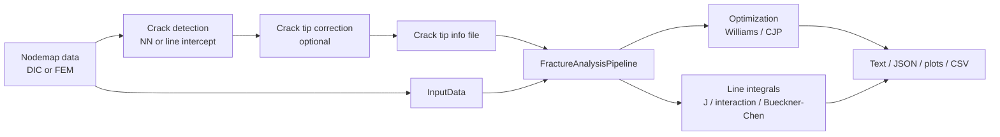

# CrackPy Exploration Knowledge Base

Status: exploration snapshot
Created: 2026-05-14
Scope: observed architecture, scientific context, data flow, coupling, and future refactor notes.

This directory is an Obsidian-style knowledge base for the current CrackPy codebase. It separates observed system reality from future architecture ideas.

## Entry Points

- [[system-map]]: package-level map, package structure, and main data flows.
- [[module-inventory]]: module-by-module class/function inventory.
- [[data-model-input]]: `InputData`, nodemap structures, material data, metadata, VTK conversion, and result I/O.
- [[fracture-analysis]]: Williams fitting, CJP fitting, line integrals, pipeline orchestration, and numerical assumptions.
- [[crack-detection]]: neural-network detection, line-intercept detection, correction, data preparation, and training.
- [[results-io-workflows]]: scripts, test workflows, result readers/writers, plotting, and operational dependencies.
- [[scientific-context]]: literature references, domain assumptions, numerical methods, and validation signals.
- [[coupling-map]]: hidden coupling, implicit lifecycle ordering, side effects, import cycles, and high fan-in/fan-out modules.
- [[refactor-notes]]: future modularization candidates. This note is intentionally separate from observed reality.
- [[glossary]]: domain and architecture vocabulary used across notes.
- [[terminology-report]]: implementation-term extraction report, naming inconsistencies, ambiguous terms, and unresolved terminology questions.

## Exploration Method

This pass combined:

- local AST inventory of modules, classes, functions, imports, and package dependencies;
- targeted code reading of core modules and scripts;
- repository searches for literature, assumptions, side effects, and TODO/prototype signals;
- six parallel read-only subagent explorations covering input/results, fracture analysis, crack detection, scripts/tests, scientific references, and architecture coupling.

No production code was refactored in this phase.

## Package Overview

CrackPy is a research package for automatic crack detection and fracture-mechanical analysis of DIC or simulation nodemap data. The README describes the intended flow:

The main architectural theme is that `InputData` is the central mutable carrier, while `FractureAnalysis` and the pipeline classes combine orchestration, algorithm selection, result storage, and output coordination.
