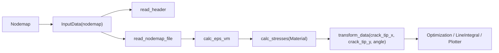

# Data Model And Input

Status: observed system reality

## Core Modules

- `crackpy/input/input_data.py`
- `crackpy/input/crack_tip_info.py`
- `crackpy/structure_elements/data_files.py`
- `crackpy/structure_elements/material.py`
- `crackpy/results/write.py`
- `crackpy/results/read.py`
- `crackpy/results/plot.py`

## `InputData`

`InputData` is the central mutable data container in CrackPy. It is also a file reader, metadata parser, transformation module, mechanics helper, VTK exporter, and mask source.

Main stored data:

- nodemap identity: `nodemap_folder`, `nodemap_name`, `nodemap_file`, `nodemap_structure`;
- geometry: `facet_id`, `coor_x`, `coor_y`, `coor_z`, optional `connections`;
- displacement: `disp_x`, `disp_y`, `disp_z`;
- strain: `eps_x`, `eps_y`, `eps_xy`, `eps_vm`, optional `eps_xz`, `eps_yz`;
- stress: `sig_x`, `sig_y`, `sig_xy`, `sig_vm`, optional `sigma_xz`, `sigma_yz`;
- principal values: `eps_1`, `eps_2`, `sig_1`, `sig_2`;
- experiment metadata: `force`, `cycles`, `displacement`, `potential`, `cracklength`, `time`, DMS fields, alignment translations, and other header-derived attributes.

Important methods:

- `read_header()`: scans comment-header lines and dynamically sets metadata attributes.
- `read_nodemap_file()`: reads semicolon-delimited data using `np.genfromtxt(..., encoding="windows-1252")`.
- `set_connection_file()`: reads element connectivity, removes invalid rows, and remaps node IDs.
- `set_data_manually()`: injects in-memory arrays instead of a nodemap file.
- `transform_data()`: mutates coordinates, displacements, strains, and any existing stresses into a crack-tip-centered coordinate frame.
- `calc_eps_vm()`: computes equivalent strain.
- `calc_stresses(material)`: computes linear-elastic stresses.
- `to_vtk()`: builds a PyVista mesh and optionally writes a `.vtk` file.
- `require_fields()`: validates that named fields exist and tracked arrays have consistent lengths.

## InputData Lifecycle

Typical lifecycle:

This order is implicit. Many downstream modules assume `sig_x`, `sig_y`, `sig_xy`, and `sig_vm` already exist, which means `calc_stresses()` is part of the interface even when not stated in type signatures.

## Nodemap Structures

`NodemapStructure` stores column indices for nodemap parsing. Default DIC order includes:

- facet ID;
- x/y/z coordinates;
- x/y/z displacements;
- `eps_x`, `eps_y`, `eps_xy`.

Observed assumptions:

- nodemap rows are semicolon-delimited;
- `row_length` exists but is not enforced;
- `strain_is_percent=True` divides `eps_x` and `eps_y` by 100, but not `eps_xy`;
- FEM stress columns are hard-coded as columns `11`, `12`, and `13` when `is_fem=True`;
- invalid `NaN` rows are dropped during load.

## Material

`Material` stores elastic constants and derived matrices:

- `E`, `nu_xy`, `sig_yield`, `plane_strain`;
- shear modulus `G`;
- stiffness matrix and inverse stiffness matrix;
- Williams/Kolosov-style `kappa`.

Observed assumptions:

- default mode is plane stress;
- `Material._inverse_stiffness_matrix()` returns a plane-stress inverse even when `plane_strain=True`;
- `InputData.calc_stresses()` applies the material stiffness matrix to strain vectors.

## Result I/O Coupling

`OutputWriter`, `Plotter`, and `OutputReader` are documented in [[results-io-workflows]], but they are included here because they directly consume the data and result shape established by `InputData` and `FractureAnalysis`.

Observed result tags:

- `Experiment_data`
- `CJP_results`
- `CJP_modeI_results`
- `Williams_fit_results`
- `SIFs_integral`
- `Bueckner_Chen_integral`
- `Path_SIFs`
- `Path_Williams_a_n`
- `Path_Williams_b_n`
- `Path_Properties`

## Side Effects

- `InputData(nodemap)` reads files immediately unless `read_header_only=True`.
- `read_header()` mutates metadata attributes.
- `read_nodemap_file()` drops any row with `NaN`.
- `set_connection_file()` mutates connectivity and requires loaded `facet_id`.
- `transform_data()` permanently changes the arrays in place.
- `to_vtk()` can create directories, save a VTK file, reread metadata, and compute principal values.
- `apply_mask()` returns a new `InputData` but does not preserve every field, such as `coor_z`, `disp_z`, metadata, nodemap identity, facet IDs, or connections.

## Important Coupling

`InputData` is the main structural interface shared by crack detection, fracture analysis, VTK conversion, plotting, and scripts. The interface is attribute-based rather than schema-based: callers know names such as `coor_x`, `disp_x`, `eps_vm`, `sig_vm`, and they also know required call order.

See [[coupling-map]] for architectural implications.

