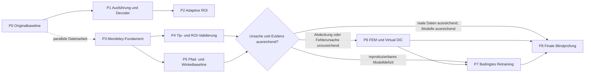

# CTD Optimization Master Implementation Plan

> **For agentic workers:** REQUIRED SUB-SKILL: Use superpowers:subagent-driven-development (recommended) or superpowers:executing-plans to implement this plan task-by-task. Steps use checkbox (`- [ ]`) syntax for tracking.

**Goal:** Die Crack-Tip-Detection der originalen CrackPy-Version schrittweise, evidenzgebunden und ohne vorschnelles Retraining optimieren und nach jeder P-Stufe einen eigenständigen Ergebnisbericht vorlegen.

**Architecture:** Der aktuelle Standard bleibt der eingefrorene P1-Pfad mit originalen Gewichten, 256 × 256 Modelleingabe und fester physischer 70-mm-ROI.
Neue Daten-, ROI-, Pfad-, Winkel-, Simulations- und Trainingskandidaten werden additiv und paarweise gegen diesen Standard geprüft.
Jede Stufe besitzt ein eigenes Daten-, Metrik-, Provenienz- und Entscheidungsgate, sodass technische Funktionsfähigkeit, Genauigkeitsgewinn und wissenschaftliche Freigabe getrennt bleiben.

**Tech Stack:** Python 3.12, CrackPy 1.3.0, PyTorch, CUDA, NumPy, SciPy, scikit-image, pytest, CrackMNIST 2.0.1, Mendeley Data `10.17632/dywwnjv22h.1` sowie bedingt eine verifizierte 2D-FEM-/Virtual-DIC-Kette.

**Spec:** `docs/ctd-optimization/p2-report.md`, ergänzt durch `docs/ctd-optimization/mendeley-annotation-schema.md` und die abgeschlossenen P0-, P1- und P2-Pläne in diesem Verzeichnis.

## Global Constraints

- Dieses Dokument ist der verbindende Optimierungsfahrplan und keine pauschale Freigabe für Refactoring, Training oder Produktivbetrieb.
- Die Arbeit bleibt ein reines CTD-Optimierungsprojekt ohne Understand-Anything-Artefakte, Knowledge-Graphs oder Architekturvisualisierungen als Nebenprodukt.
- Die originale CrackPy-1.3.0-Implementierung und ihre veröffentlichten Modellgewichte bleiben die Referenz.
- Originalgewichte und Legacy-Fixtures dürfen niemals überschrieben oder in ihrer numerischen Erwartung stillschweigend verändert werden.
- P1 mit fester physischer 70-mm-ROI bleibt der Standard, bis eine spätere Stufe alle Promotionsgates erfüllt.
- P2.1 und P2.2 bleiben implementierte experimentelle Varianten, weil sie technisch sicher, aber auf der bisherigen Realevidenz ungenauer waren.
- CrackMNIST dient als Einzelbild-, Regression- und Validierungsdatensatz und darf nicht als physische Sequenzevidenz ausgegeben werden.
- Mendeley darf erst nach freigegebener physischer Kalibrierung und unabhängiger Annotation quantitative Tip-, Pfad-, Winkel- oder ROI-Aussagen tragen.
- Alle Frames, Crops, Interpolationen, Augmentationen, Zeitfenster und Pseudolabels einer Probe verbleiben vollständig in demselben Split.
- Kalibrierung, Decoderwahl, Gate-Tuning und Modellwahl verwenden ausschließlich Development und Validation, niemals den finalen Testsplit.
- Referenzlabels werden ausschließlich nach der kausalen ROI-Entscheidung zur Auswertung angehängt.
- Resultatbeeinflussende Parameter, Einheiten, Datenstände, Modelle und Gewichte werden vor einem Lauf aufgelöst und gehasht.
- Simulation und Virtual DIC dürfen unabhängige reale Labels ergänzen, aber niemals ersetzen.
- Retraining ist bis zum expliziten P7-Go/No-Go untersagt.
- Nach jeder P-Stufe werden `pN-results.json`, `pN-report.md` und `pN-runbook.md` erzeugt und vor dem Start der nächsten nicht parallelen Stufe vorgestellt.
- Vollständige Sätze in langen Markdown-Dokumenten stehen jeweils auf einer eigenen physischen Zeile.

---

## Gesamtfolge

P3 war konzeptionell bereits parallel zu P0 bis P2 vorgesehen und ist nach deren Abschluss der nächste aktive Arbeitsstrang.

P6 und P7 sind bedingte Stufen und werden nur durch ihre ausdrücklich definierten Gates geöffnet.

## Aktuelles Bottleneck-Ledger

| Pfad | Gemessene Größenordnung | Einordnung | Konsequenz |
|---|---:|---|---|
| Williams-Korrektur | 15,716 s Median pro Korrektur | Größter optionaler Engpass und bisher ungenauer | Bleibt deaktiviert und wird nur mit unabhängiger Evidenz neu betrachtet. |
| Originale DIC-Interpolation mit drei `griddata`-Aufrufen | 2,44–2,48 s pro 70-mm-ROI | Größter Engpass im normalen Roh-DIC-Pfad | Gemeinsame Triangulation bleibt Pflicht. |
| P1-Interpolation mit gemeinsamer Triangulation | 0,80–0,88 s pro 70-mm-ROI | Etwa dreifach schneller, aber weiterhin dominant | P3/P4 prüfen Parsing, Triangulation, Zielraster und wiederverwendbare Geometrie getrennt. |
| Erstes Laden beider Originalmodelle | 313 ms | Einmaliger Engpass, kritisch bei wiederholtem Laden | Modelle bleiben persistent und werden genau einmal geladen. |
| P1 Tip-only, Batch 1 | 7,40 ms pro Bild, davon 4,72 ms Tip-Forward | Kein primärer End-to-End-Engpass | Netz-Mikrooptimierungen sind nachgeordnet. |
| P1 Tip, Pfad und Winkel, Batch 1 | 10,87 ms pro Bild | Relevant, aber deutlich kleiner als Interpolation | Pfad-/Winkeloptimierung folgt erst nach belastbarer Genauigkeitsbaseline. |
| Datei-I/O und Nodemap-Parsing | Noch nicht separat im produktiven Gesamtlauf isoliert | Verbleibende Profiling-Lücke | P3 beginnt mit einer vollständigen End-to-End-Zerlegung auf Mendeley-Rohdaten. |

Die bisherige Messung ist phasenaufgelöst und reproduzierbar, aber noch kein vollständiges Produktionsprofil vom Archivmitglied bis zum geschriebenen Ergebnis.

## Verantwortliche Key-Codeänderungen

Die folgenden Änderungen erklären sowohl die gemessene Beschleunigung als auch die Grenzen des aktuellen Stands.

| Änderung | Verantwortlicher Code | Wirkung | Statusgrenze |
|---|---|---|---|
| Gemeinsame Interpolationstriangularisierung | `crackpy/crack_detection/data/optimized_interpolation.py` baut pro Frame und ROI genau eine `Delaunay`-Triangulation und interpoliert die Kanäle gemeinsam über `LinearNDInterpolator`. | Beseitigt die drei unabhängigen Triangulationen der historischen `griddata`-Aufrufe in `crackpy/crack_detection/data/interpolation.py` und senkt den gemessenen 70-mm-Lauf von 2,44–2,48 s auf 0,80–0,88 s. | Der verbleibende Interpolationslauf ist weiterhin der größte normale Engpass und muss in P3 weiter zerlegt werden. |
| Persistente eingefrorene Inferenz | `crackpy/crack_detection/inference.py` hält geladene Modelle in `FrozenCtdInference`, setzt sie einmalig auf Evaluation und verwendet `torch.inference_mode()`. | Entfernt wiederholtes Laden aus der Bildschleife und kapselt die einmaligen rund 313 ms Modellstartkosten. | Die historische Pipeline wurde nicht stillschweigend umgebogen; die optimierte Ausführung bleibt bis zur Promotion explizit auswählbar. |
| Echter Tip-only-Pfad | `FrozenCtdInference` erlaubt ein fehlendes Pfadmodell, während `crackpy/benchmarking/ctd_p1_runtime.py` Tip-only-Läufe mit vorhandenem Pfadmodell ablehnt. | Verhindert, dass ein unnötiger Path-Forward als Tip-only gemessen oder ausgeführt wird, und begrenzt Batch-1 auf rund 7,40 ms statt rund 10,87 ms für Tip, Pfad und Winkel. | Dieser Hebel gilt nur für Aufgaben, die tatsächlich ausschließlich den Tip benötigen. |
| Phasengetrennte Vergleichsmessung | `crackpy/benchmarking/ctd_p1_runtime.py` misst kaltes Laden, Transfer, Forward, Decoder, Postprocessing sowie alte und neue Interpolation auf denselben Eingaben getrennt. | Macht die Interpolation und Williams statt des Netzes als dominante Kosten sichtbar. | Diese Änderung verbessert primär die Beweisführung und ist selbst keine Laufzeitoptimierung. |
| Kausale adaptive ROI mit Fallbacks | `crackpy/crack_detection/adaptive_roi.py` implementiert physische ROI-Geometrie, Rezentrierung, Gates und 40/55/70-mm-Fallbacks; `crackpy/benchmarking/ctd_p2_runner.py` bindet sie an Roh-DIC-Interpolation und eingefrorene Inferenz. | Erlaubt kleinere Suchfelder ohne Referenzleckage und zeichnet jeden Versuch reproduzierbar auf. | Die P2-Varianten bestanden die Sicherheitsgates, verschlechterten aber die Tip-Lokalisierung und bleiben deshalb experimentell. |
| Isolierte Williams-Messung | `crackpy/benchmarking/ctd_baseline.py` führt die vorhandene Williams-Korrektur optional und separat aus. | Belegt den Median von 15,716 s pro Korrektur, ohne ihn in den Standardpfad einzuschleusen. | Williams bleibt deaktiviert, bis unabhängige Genauigkeitsevidenz einen Nutzen zeigt. |

Damit ist die wichtigste technische Erkenntnis eindeutig: Die größte bereits realisierte Beschleunigung stammt aus der gemeinsamen Triangulation, während persistente Modelle und Tip-only die neuronale Ausführung verschlanken.
Die adaptive ROI ist dagegen bislang ein sauber implementierter, aber wissenschaftlich nicht promovierter Kandidat.

## Einheitlicher Vertrag für jede neue P-Stufe

Jede Stufe muss dieselben fünf Fragen beantworten.

1. Welche Daten und Referenzen wurden verwendet und welche Aussage erlauben sie?
2. Welche Änderung wurde gegenüber dem eingefrorenen Standard isoliert?
3. Welche primären und sekundären Metriken wurden vor Öffnung des Tests festgelegt?
4. Welches Gate wurde bestanden oder verfehlt und warum?
5. Welche Konfiguration bleibt danach Standard und welche Variante bleibt experimentell?

Ein Stufenreport ohne eindeutige Antwort auf diese fünf Fragen gilt als unvollständig.

---

## P0: Originalbaseline

**Status:** Abgeschlossen.

**Detailplan:** `docs/superpowers/plans/2026-09-02-ctd-p0-baseline.md`

**Ergebnis:** `docs/ctd-optimization/p0-report.md`

- [x] Originalmodelle, Gewichte, Umgebung und CrackMNIST-Baseline einfrieren.
- [x] Tip-, Pfad-, Winkel-, Laufzeit- und Williams-Metriken definieren.
- [x] Repository-Fixtures und Dummy2 als interne beziehungsweise pseudoreferenzierte Evidenz abgrenzen.
- [x] Mendeley-A0-Audit und erstes Annotationsschema erstellen.
- [x] Eigenständigen P0-Report und Runbook erzeugen.

**Entscheidung:** Die originale Baseline ist reproduzierbar, Williams dominiert optional die Laufzeit und besitzt keinen belegten Genauigkeitsnutzen.

## P1: Ausführungs-, Decoder- und Auflösungsoptimierung

**Status:** Abgeschlossen.

**Detailplan:** `docs/superpowers/plans/2026-09-02-ctd-p1-optimizations.md`

**Ergebnis:** `docs/ctd-optimization/p1-report.md`

- [x] Persistente, eingefrorene Inferenz und echten Tip-only-Betrieb implementieren.
- [x] Die dreifache DIC-Triangulation durch eine gemeinsame Triangulation ersetzen.
- [x] Decoder und Unsicherheit ausschließlich auf CrackMNIST-Validation auswählen.
- [x] 256, 128 und 64 Pixel gegen P0 prüfen.
- [x] Eigenständigen P1-Report und Runbook erzeugen.

**Entscheidung:** 256 Pixel und der originale maskenbasierte Tipdecoder bleiben Standard, während 128 und 64 Pixel wegen deutlicher Genauigkeitsverluste verworfen werden.

## P2: Adaptive physische ROI

**Status:** Abgeschlossen.

**Detailplan:** `docs/superpowers/plans/2026-09-02-ctd-p2-adaptive-roi.md`

**Ergebnis:** `docs/ctd-optimization/p2-report.md`

- [x] Deterministische P2.1-Zustandsmaschine mit konstantem 40-mm-Fenster implementieren.
- [x] P2.2 um 55-mm-Expanded- und 70-mm-Full-search-Fallback ergänzen.
- [x] Referenzleckage durch strikte Trennung von Steuerung und Auswertung verhindern.
- [x] P1 und P2 auf identischen Frames, Referenzen, Modellen und Suchfeldern paarweise vergleichen.
- [x] Eigenständigen P2-Report und Runbook erzeugen.

**Entscheidung:** Alle technischen Sicherheitsgates bestehen, aber die Lokalisierung verschlechtert sich gegenüber der festen 70-mm-P1-ROI, weshalb keine adaptive Variante promoviert wird.

---

## P3: Mendeley-Datenfreigabe, Kalibrierung und Annotation

**Ziel:** Aus den verifizierten Mendeley-Quellen einen leckagefreien, physisch kalibrierten und unabhängig geprüften Tip-/Pfad-/Winkel-Datensatz erzeugen.

**Warum jetzt:** P2 hat gezeigt, dass technische Sicherheitsgates ohne unabhängige Ortsreferenzen keine Optimierung belegen und dass kleinere ROIs das Originalmodell nicht automatisch verbessern.

**Files:**

- Create: `crackpy/benchmarking/mendeley_ingest.py`
- Create: `crackpy/benchmarking/mendeley_annotations.py`
- Create: `crackpy/benchmarking/ctd_p3.py`
- Create: `scripts/crack_detection/prepare_ctd_p3.py`
- Test: `crackpy/tests/test_benchmarking/test_mendeley_ingest.py`
- Test: `crackpy/tests/test_benchmarking/test_mendeley_annotations.py`
- Create: `docs/ctd-optimization/p3-results.json`
- Create: `docs/ctd-optimization/p3-report.md`
- Create: `docs/ctd-optimization/p3-runbook.md`

**Interfaces:**

- `build_mendeley_manifest(cache_root, split_seed=0)` erzeugt ein Manifest mit Datasetversion, Quellenhash, Proben-ID, Frame-ID, Zykluszahl, Archivmitglied, Qualitätsflags und Splitzuordnung, damit jedes Ergebnis bis zur Quelldatei rückverfolgbar bleibt.
- `CalibrationRecord` enthält Kalibrier-ID, Status, Achsrichtungen, Ursprung, homogene Pixel-zu-Millimeter-Transformation, physische Feldgrenzen, Unsicherheit und Reviewer, damit Koordinaten und ROI-Größen eindeutig sind.
- `CrackAnnotation` enthält Frame-ID, `crack_tip_id`, Seite, sichtbaren Tip, geordnete Pfadpolylinie, lokale Winkelreferenz, Sichtbarkeit, Unsicherheit, Qualitätsflags und Reviewstatus, damit zentrale Risse und mehrere sichtbare Tips nicht in ein singuläres Label gezwungen werden.
- `validate_annotation_release(manifest, calibrations, annotations)` erzeugt Counts, Ausschlüsse, Leakageprüfung, Inter-Annotator-Metriken und einen unveränderlichen Releasehash.

- [ ] **Task 1: Produktives End-to-End-Profil und A1-Ingest**

  Zerlege Roharchivzugriff, CSV-Parsing, Nodemap-Aufbau, Qualitätsprüfung, Triangulation, Rasterauswertung, Normalisierung, Inferenz, Decoder und Schreiben mit denselben Frames in getrennte Phasen.
  Löse die Differenz zwischen 17.897 lokal inventarisierten und 17.925 publizierten Frames durch ein Mitglieds- und Ausschlussmanifest auf.
  Markiere den bekannten nichtendlichen Frame ausdrücklich und definiere reproduzierbare NaN- und Dekorrelationsregeln.

- [ ] **Task 2: Physische Kalibrierung und Koordinatenvertrag**

  Bestimme Ursprung, Achsrichtungen, Feldgrenzen und Transformation aus den Rohdaten und vorhandenen Versuchsinformationen.
  Speichere Kalibrierunsicherheit und verbiete akzeptierte Tip-, Pfad- oder Winkelwerte ohne freigegebene Kalibrier-ID.
  Definiere Winkel modulo 180 Grad mit globaler positiver x-Achse als Nullrichtung und mathematisch positivem Drehsinn.

- [ ] **Task 3: Annotationsschema 1.1 und Blindpilot**

  Ergänze Multi-Tip-Identität, Pfadrichtung vom sichtbaren Risskörper zum Tip, Regeln für Verzweigungen und Unterbrechungen sowie die rein nachgelagerte Rolle einer idealen ROI.
  Friere vor produktiver Annotation ein probengruppiertes Manifest mit 11 Development-, 4 Validation- und 4 finalen Testproben ein.
  Halte Modellvorhersagen vor Annotatoren verborgen.
  Annotiere einen über Rissart, Anfangswinkel, Lastniveau, Randnähe und Feldqualität geschichteten Pilot unabhängig doppelt.

- [ ] **Task 4: Review, Präzisionsregel und Labelrelease**

  Annotiere mindestens 20 Prozent jeder produktiven Schicht doppelt und entscheide jeden Konflikt durch eine dritte, unabhängige Prüfung.
  Akzeptiere den Annotationsprozess, wenn der doppelt annotierte Pilot auf dem äquivalenten 256er-Raster einen Tip-Median von höchstens einem Pixel, einen Tip-P95 von höchstens zwei Pixeln, einen Pfad-HD95 von höchstens zwei Pixeln sowie einen Winkel-Median von höchstens 5 Grad und einen Winkel-P95 von höchstens 10 Grad erreicht.
  Erzeuge dichte, zusammenhängende Sequenzfenster auf Validation und finalem Test, bis die specimen-basierte 95-Prozent-Konfidenzintervall-Halbbreite höchstens 0,25 mm für den Tip-Median und 0,50 mm für den Tip-P95 beträgt oder alle akzeptierbaren Frames ausgeschöpft sind.
  Berichte eine nicht erreichte Präzision als Evidenzgrenze und nicht als bestanden.

- [ ] **Task 5: P3-Abschluss**

  Speichere nur Manifeste, Schemata, Hashes und zulässige abgeleitete Annotationen im Branch, während die Roharchive im lokalen Daten-Cache bleiben.
  Stelle Datenabdeckung, Ausschlüsse, Kalibrierung, Reviewerübereinstimmung, Splitintegrität und Profiling-Ergebnis im separaten P3-Report vor.

**P3-Gate:** Alle verwendeten Quellen sind gehasht, die Framezahl-Differenz ist erklärt oder explizit ausgeschlossen, jede akzeptierte Annotation ist kalibriert und geprüft, Split-Leakage beträgt null und der finale Test bleibt für Entwicklung und Auswahl blind.

---

## P4: Unabhängige Frozen-Tip- und ROI-Validierung

**Ziel:** Das unveränderte Originalmodell mit fester 70-mm-ROI, P2.1 und P2.2 erstmals auf unabhängigen, physisch kalibrierten Sequenzlabels vergleichen und die Ursache des P2-Nachteils bestimmen.

**Warum vor Retraining:** Erst dieser Vergleich trennt Controller-, Maßstabs-, Interpolations-, Feldqualitäts- und eigentliche Modellfehler.

**Files:**

- Create: `crackpy/benchmarking/ctd_p4.py`
- Create: `scripts/crack_detection/benchmark_ctd_p4.py`
- Test: `crackpy/tests/test_benchmarking/test_ctd_p4.py`
- Create: `docs/ctd-optimization/p4-results.json`
- Create: `docs/ctd-optimization/p4-report.md`
- Create: `docs/ctd-optimization/p4-runbook.md`

**Interfaces:**

- `P4RunConfig` enthält P1- und P2-Artefakthashes, P3-Releasehash, Split, ROI-Varianten, Gatekonfiguration, Bootstrap-Seed und Gerätekonfiguration, damit kein testabhängiger Wert unbemerkt verändert werden kann.
- `run_p4_benchmark(config)` erzeugt paarweise Frame- und specimen-basierte Metriken, Fehlerursachen, Laufzeitphasen und eine getrennte technische sowie wissenschaftliche Entscheidung.

- [ ] **Task 1: Evaluationsvertrag vorregistrieren**

  Friere Tip-Erfolg, endgültige Ausfallrate, Median, P95, Maximum, selbstsichere Fehler, sichere Coverage, Randverletzungen, Fallbacks, Recovery und End-to-End-Laufzeit als Metriken ein.
  Berechne Konfidenzintervalle specimen-basiert und behandle zu kleine Subgruppen als nicht auswertbar.
  Verwende die in P3 eingefrorene Inter-Annotator-Streuung als Äquivalenzgrenze, ohne sie nach Sichtung des Tests zu verändern.

- [ ] **Task 2: Same-Scenario-Validation**

  Vergleiche P1 mit 70 mm, P2.1 mit 40 mm und P2.2 mit 40/55/70 mm auf exakt denselben Validation-Sequenzen.
  Halte Modell, Decoder, Rohfelder, Referenzen und 256er-Zielraster konstant.
  Erlaube ROI- und Gate-Refinement ausschließlich auf Validation und protokolliere jede getestete Variante.

- [ ] **Task 3: Fehlerursachenanalyse**

  Zerlege Fehler nach physischer ROI, Interpolationsauflösung, Feldqualität, Rissart, Winkel, Lastniveau, Randnähe, Zyklusdifferenz und Konflikt der beiden Tipköpfe.
  Führe kontrollierte Ablationen durch, bei denen jeweils nur ROI-Größe, Interpolationsverfahren oder Gate geändert wird.
  Ordne jeden reproduzierbaren Nachteil primär Controller, Datentransformation, Labelunsicherheit oder Modell zu.

- [ ] **Task 4: Einmalige P4-Testbestätigung**

  Friere die auf Validation gewählte Konfiguration und öffne den P3-Testsplit genau einmal.
  Promoviere eine adaptive ROI nur bei mindestens 99 Prozent sicherer Coverage, null Randverletzungen, keiner höheren Ausfallrate, nicht schlechterem Median und P95 sowie einer einseitigen specimen-basierten 95-Prozent-Obergrenze innerhalb der P3-Äquivalenzgrenze.

- [ ] **Task 5: P4-Abschluss**

  Stelle Same-Scenario-Ergebnisse, Subgruppen, Bottleneck-Profil, Ablationen und die Standardentscheidung im separaten P4-Report vor.

**P4-Gate:** Wenn keine adaptive Variante alle Gates erfüllt, bleibt die feste 70-mm-P1-ROI Standard und die Arbeit geht ohne weitere ROI-Schwellwertsuche zu P5 beziehungsweise zur Ursachenentscheidung.

---

## P5: Originalmodell-Baseline für Pfad und Winkel

**Ziel:** Pfad und lokalen Winkel des unveränderten originalen CrackPy-Modells auf freigegebenen P3-Labels messen und Tipfehler von Pfad-/Winkelfehlern trennen.

**Warum getrennt:** Ein guter Tip garantiert keinen korrekten sichtbaren Pfad, und ein falscher Tip kann die Winkelmessung künstlich verschlechtern.

**Files:**

- Create: `crackpy/benchmarking/ctd_p5_path_angle.py`
- Create: `scripts/crack_detection/benchmark_ctd_p5.py`
- Test: `crackpy/tests/test_benchmarking/test_ctd_p5_path_angle.py`
- Create: `docs/ctd-optimization/p5-results.json`
- Create: `docs/ctd-optimization/p5-report.md`
- Create: `docs/ctd-optimization/p5-runbook.md`

**Interfaces:**

- `P5RunConfig` enthält P3-Releasehash, P4-Standard-ROI, Originalmodellhash, 256er-Geometrie, Winkel-Fensterlänge, Split und Bootstrap-Seed, damit Pfad- und Winkelvergleich denselben eingefrorenen Kontext nutzen.
- `run_p5_benchmark(config)` liefert Segment-, physische Pfad-, Tip-nahe Pfad-, Winkel-, Ausfall- und Laufzeitmetriken jeweils mit und ohne Verwendung des vorhergesagten Tips.

- [ ] **Task 1: Originalbaseline ohne Refinement**

  Führe das originale UNetPath mit seiner historischen 256 × 256 Geometrie aus.
  Berichte Dice und IoU nur ergänzend zu symmetrischer physischer Pfaddistanz, HD95, Tip-nahem Pfadfehler und absoluter Winkelabweichung modulo 180 Grad.

- [ ] **Task 2: Fehlerkopplung isolieren**

  Berechne Pfad und Winkel einmal relativ zum vorhergesagten Tip und einmal relativ zum ausschließlich für Auswertung eingesetzten Referenztip.
  Quantifiziere damit, welcher Anteil des Winkelfehlers vom Tip und welcher vom Pfadmodell stammt.

- [ ] **Task 3: Validierungsgebundenes Refinement**

  Prüfe nur auf Validation klar abgegrenzte Nachbearbeitungen wie Schwelle, Skelettbereinigung, physische Winkel-Fensterlänge und robuste lokale Tangentenanpassung.
  Verändere Modellgewichte, Auflösung und ROI in dieser Stufe nicht.

- [ ] **Task 4: Einmalige Testbestätigung und P5-Abschluss**

  Öffne nach Freeze den finalen Test genau einmal und berichte Originalbaseline sowie den Validation-Kandidaten getrennt.
  Promoviere Nachbearbeitung nur, wenn Ausfälle, physische Pfaddistanz, HD95 und Winkelmedian/P95 nicht schlechter werden und Tipmetriken unverändert bleiben.
  Stelle die Ergebnisse im separaten P5-Report vor.

**P5-Gate:** P5 entscheidet getrennt für Pfad und Winkel, ob die Originalgewichte ausreichen, reine Nachbearbeitung genügt oder ein reproduzierbares Modelldefizit an P7 übergeben wird.

---

## P6: Bedingte FEM- und Virtual-DIC-Evidenz

**Ziel:** Fehlende oder seltene reale Randfälle mit einer verifizierten zweidimensionalen Simulations- und Messkette kontrolliert untersuchen.

**Warum bedingt:** Simulation ist nur dann sinnvoll, wenn P3 bis P5 eine konkrete Evidenz- oder Ursachenlücke zeigen.

**Startbedingung:** P6 wird geöffnet, wenn mindestens eine relevante P4/P5-Subgruppe nicht auswertbar ist, ein beobachteter Fehlermodus weniger als zehn reale, freigegebene Frames besitzt oder Maßstabs-, Rausch- und Modellursache mit realen Ablationen nicht getrennt werden können.

**Files:**

- Create: `crackpy/benchmarking/ctd_fem_manifest.py`
- Create: `crackpy/benchmarking/ctd_virtual_dic.py`
- Create: `crackpy/benchmarking/ctd_p6.py`
- Create: `scripts/crack_detection/benchmark_ctd_p6.py`
- Test: `crackpy/tests/test_benchmarking/test_ctd_virtual_dic.py`
- Test: `crackpy/tests/test_benchmarking/test_ctd_p6.py`
- Create: `docs/ctd-optimization/p6-results.json`
- Create: `docs/ctd-optimization/p6-report.md`
- Create: `docs/ctd-optimization/p6-runbook.md`

**Interfaces:**

- `SimulationCase` enthält Fall-ID, 2D-Geometrie, Material, Randbedingungen, Last, Meshkonvergenz, wahre Tip-/Pfadgeometrie und Solverhash, damit Simulationstruth prüfbar bleibt.
- `VirtualDicConfig` enthält Raster, Speckle-/Messmodell, Rauschparameter, fehlende Werte, Dekorrelation, Interpolation und Seed, damit der Übergang von Simulation zu beobachtetem DIC-Feld reproduzierbar ist.
- `run_p6_benchmark(cases, virtual_dic_config, frozen_ctd_config)` trennt Simulationstruth, gerenderte Beobachtung, rekonstruierte DIC und CTD-Ergebnis in der Provenienz.

- [ ] **Task 1: 2D-FEM-Vertrag und Konvergenz**

  Begrenze den Scope ausdrücklich auf ebene Oberflächenfelder und erhebe keine 3D-, DVC- oder Crack-Front-Ansprüche.
  Akzeptiere einen Fall erst, wenn Meshverfeinerung Tip-, Pfad- und Verschiebungsreferenzen innerhalb der vorab gespeicherten numerischen Toleranz stabilisiert.

- [ ] **Task 2: Virtual-DIC-Messmodell**

  Modelliere Auflösung, Rauschen, fehlende Werte, Dekorrelation und Interpolation getrennt und validiere jede Stufe gegen bekannte Eingaben.
  Erzeuge kontrollierte Skalen-, Winkel-, Rand-, Sprung-, Mehrtip- und Sichtverlustfälle.

- [ ] **Task 3: Diagnose und Robustheitsbericht**

  Vergleiche P1, P2 und P5-Kandidaten auf denselben simulierten Fällen und führe jede Abweichung auf Simulation, Messmodell, Interpolation, Controller oder Modell zurück.
  Verwende synthetische Ergebnisse für Diagnose, Stresstests und bedingt Training, niemals als reale Promotion.
  Stelle Scope, Konvergenz, Sim-to-real-Grenzen und Ergebnisse im separaten P6-Report vor.

**P6-Gate:** Nur validierte Fälle mit getrennter Solver- und Messmodellprovenienz dürfen P7 informieren, während P8 weiterhin reale Blindtest-Evidenz verlangt.

---

## P7: Explizites Retraining-Go/No-Go und bedingtes Training

**Ziel:** Erst nach P4 bis P6 entscheiden, ob Tip- oder Pfad-/Winkelmodelle tatsächlich neu trainiert werden müssen und gegebenenfalls den kleinsten begründeten Trainingsschritt durchführen.

**Warum zuletzt:** Controller-, Kalibrierungs-, Interpolations- oder Labelprobleme dürfen kein Retraining auslösen.

**Startbedingung:** P7 wird nur geöffnet, wenn ein reproduzierbares Defizit auf Validation dem Modell oder seiner Skalen-/Domänenabbildung zugeordnet ist und P4/P5-Gates mit eingefrorenen Gewichten verfehlt werden.

**Files:**

- Create: `crackpy/benchmarking/ctd_p7_training.py`
- Create: `scripts/crack_detection/train_ctd_p7.py`
- Create: `scripts/crack_detection/benchmark_ctd_p7.py`
- Test: `crackpy/tests/test_benchmarking/test_ctd_p7_training.py`
- Create: `docs/ctd-optimization/p7-results.json`
- Create: `docs/ctd-optimization/p7-report.md`
- Create: `docs/ctd-optimization/p7-runbook.md`

**Interfaces:**

- `P7TrainingConfig` enthält Ausgangsmodell-ID, Ausgangsgewichtshash, P3-Datenrelease, erlaubte Splits, ROI-/Skalenkodierung, synthetischen Anteil, Seed, Optimierer, Lernplan und Abbruchregel, damit jeder Trainingslauf vollständig reproduzierbar ist.
- `P7Candidate` enthält neue Modell- und Gewichts-ID, Trainingshash, Auswahlmetrik, Kalibrierung, Laufzeit und gültigen Einsatzbereich, damit Original- und Kandidatenmodelle koexistieren.

- [ ] **Task 1: Go/No-Go je Produkt**

  Entscheide Tip, Pfad und Winkel getrennt.
  Wähle No-Go, wenn die eingefrorenen Modelle ihre P4/P5-Gates erfüllen oder das Defizit nicht eindeutig dem Modell zugeordnet werden kann.

- [ ] **Task 2: Kleinste begründete Trainingsvariante**

  Beginne bei Bedarf mit Fine-Tuning der originalen Architektur auf P3-Development und wähle ausschließlich auf P3-Validation.
  Prüfe eine physische ROI-/Skalenkonditionierung nur dann, wenn P4 einen reproduzierbaren Skalenfehler zeigt.
  Prüfe ein kausales Sequenzmodell nur dann, wenn Einzelbildmodelle auf zusammenhängenden Sequenzen systematisch scheitern und keine zukünftigen Frames als Eingabe verwendet werden.

- [ ] **Task 3: Synthetische Daten ablatieren**

  Verwende P6-Fälle nur in vorab fixierten Anteilen und berichte reale-only, synthetische-only und gemischte Ablationen.
  Erlaube keinem synthetischen Testfall die Auswahl oder finale reale Bewertung zu ersetzen.

- [ ] **Task 4: Kandidatenfreeze und P7-Abschluss**

  Speichere neue Gewichte außerhalb der Originaldateien mit stabiler Modell-ID, SHA-256, Trainingskonfiguration und Datenhash.
  Stelle Genauigkeit, Robustheit, Kalibrierung, Laufzeit und Go/No-Go im separaten P7-Report vor.

**P7-Gate:** Ein Kandidat erreicht P8 nur, wenn er auf Validation alle einschlägigen P4/P5-Sicherheits- und Genauigkeitsgates erfüllt und seine Verbesserung in Ablationen dem Training zugerechnet werden kann.

---

## P8: Finale blinde Systemprüfung und Promotion

**Ziel:** Den vollständig eingefrorenen End-to-End-Kandidaten genau einmal auf den unberührten realen Testproben bewerten und den finalen CrackPy-Standard festlegen.

**Warum eigene Stufe:** Eine finale Testauswertung darf keine weitere Parameter- oder Modellwahl auslösen.

**Files:**

- Create: `crackpy/benchmarking/ctd_p8_release.py`
- Create: `scripts/crack_detection/benchmark_ctd_p8.py`
- Test: `crackpy/tests/test_benchmarking/test_ctd_p8_release.py`
- Create: `docs/ctd-optimization/p8-results.json`
- Create: `docs/ctd-optimization/p8-report.md`
- Create: `docs/ctd-optimization/p8-runbook.md`

**Interfaces:**

- `P8ReleaseConfig` enthält alle eingefrorenen Modell-, Daten-, Annotation-, ROI-, Decoder-, Pfad-, Winkel- und Simulations-Evidence-Hashes sowie den finalen Split, damit die Blindprüfung keine unaufgelöste Wahl enthält.
- `run_p8_release(config)` gibt vollständige Tip-, ROI-, Pfad-, Winkel-, Ausfall-, Robustheits-, Laufzeit- und Provenienzresultate sowie genau eine Promotionsempfehlung zurück.

- [ ] **Task 1: Vollständigen Freeze prüfen**

  Lehne den Lauf ab, wenn ein Hash, Split, Gate, Parameter, Modell oder Annotationsrelease fehlt oder vom freigegebenen Stand abweicht.

- [ ] **Task 2: Reale Blindprüfung genau einmal ausführen**

  Werte alle vier finalen Testproben mit specimen-basierten Konfidenzintervallen und vorregistrierten Subgruppen aus.
  Führe keine Nachkalibrierung, Schwellwertänderung oder Kandidatenauswahl nach Sichtung der Ergebnisse durch.

- [ ] **Task 3: Promotion entscheiden**

  Promoviere nur, wenn Tip-, ROI-, Pfad-/Winkel-, Ausfall-, Robustheits- und Laufzeitgates gemeinsam erfüllt sind.
  Behalte andernfalls P1 mit fester 70-mm-ROI als Standard und kennzeichne alle späteren Kandidaten als experimentell oder verworfen.

- [ ] **Task 4: Evidence Profile und Abschlussartefakte erzeugen**

  Dokumentiere gültige Einsatzbereiche, nicht auswertbare Bereiche, bekannte Grenzen, Unsicherheit, Daten- und Gewichtshashes sowie die Trennung zwischen realer, Repository-, Pseudoreferenz- und Simulationsevidenz.
  Stelle `p8-results.json`, `p8-report.md` und `p8-runbook.md` als finalen Planungsloop-Abschluss vor.

**P8-Gate:** Die finale Entscheidung ist abgeschlossen und wird nicht durch weitere Auswertung desselben Testsplit revidiert.

---

## Abbruch- und Rückfallregeln

- Wenn P3 keine verlässliche physische Kalibrierung erzeugt, werden P4 bis P8 nicht als quantitative physische Validierung ausgeführt.
- Wenn P3 keine ausreichende Testpräzision erreicht, werden Ergebnisse des betreffenden Bereichs als nicht auswertbar gemeldet.
- Wenn P4 die adaptive ROI erneut verwirft, bleibt der Controller als experimentelles Sicherheitsmodul erhalten, aber die feste P1-ROI bleibt Standard.
- Wenn P5 zeigt, dass der Winkelfehler primär vom Tip stammt, wird kein separates Winkelmodell trainiert, bevor das Tipproblem gelöst ist.
- Wenn P6 keine belastbare Simulations- und Messmodellkonvergenz erreicht, werden seine Daten weder für Auswahl noch Training verwendet.
- Wenn P7 kein eindeutig modellbedingtes Defizit oder keinen Validation-Gewinn zeigt, findet kein Retraining statt.
- Wenn P8 ein einziges Pflichtgate verfehlt, erfolgt keine Teilpromotion des Gesamtsystems ohne einen separat vorregistrierten Produktentscheid für Tip, Pfad oder Winkel.

## Masterplan-Abschlusskriterium

Der Plan ist abgeschlossen, wenn P8 eine reproduzierbare Standardentscheidung mit vollständigen Artefakten liefert oder eine frühere Abbruchregel nachvollziehbar belegt, warum P1 dauerhaft Standard bleibt.
